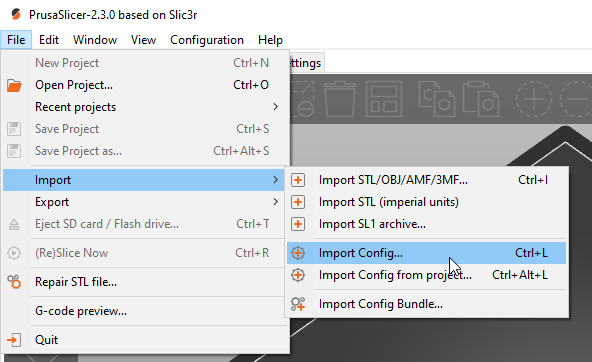

# swablab PrusaSlicer settings
Ini files can be imported with File > Import > Import Config.

For more information have a look at the [PrusaSlicer docs](https://help.prusa3d.com/en/article/general-info_1910)